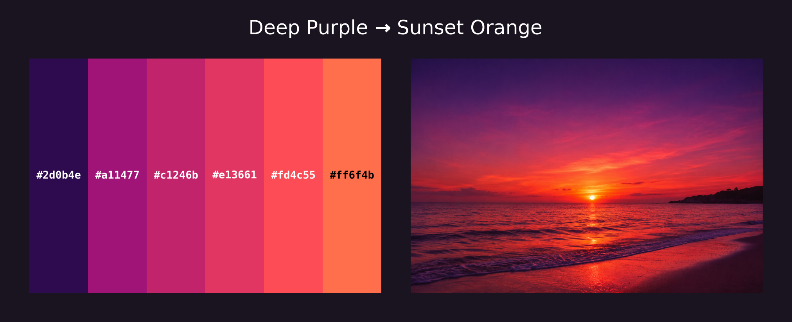
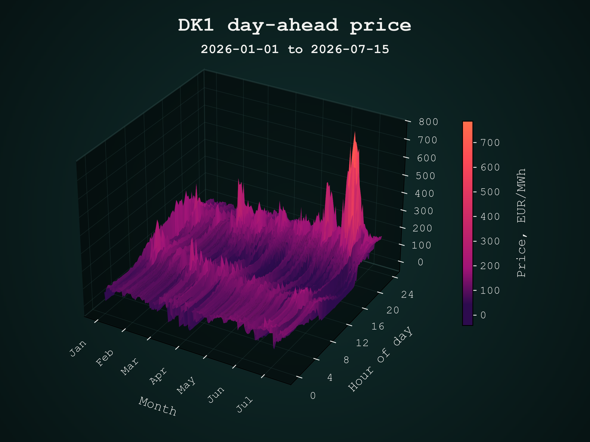
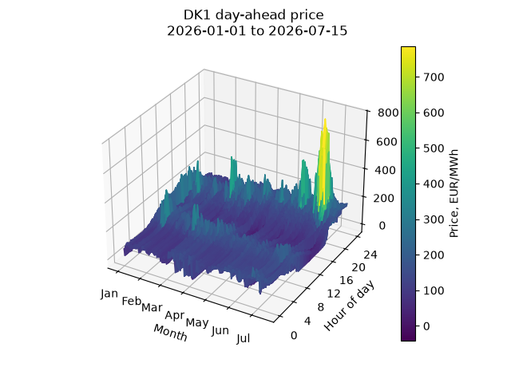
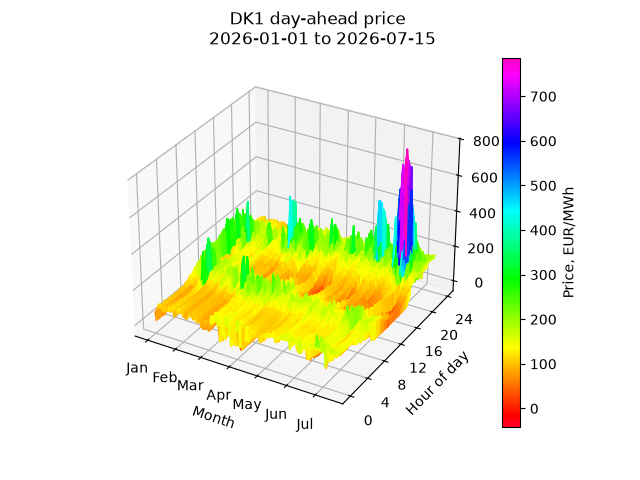
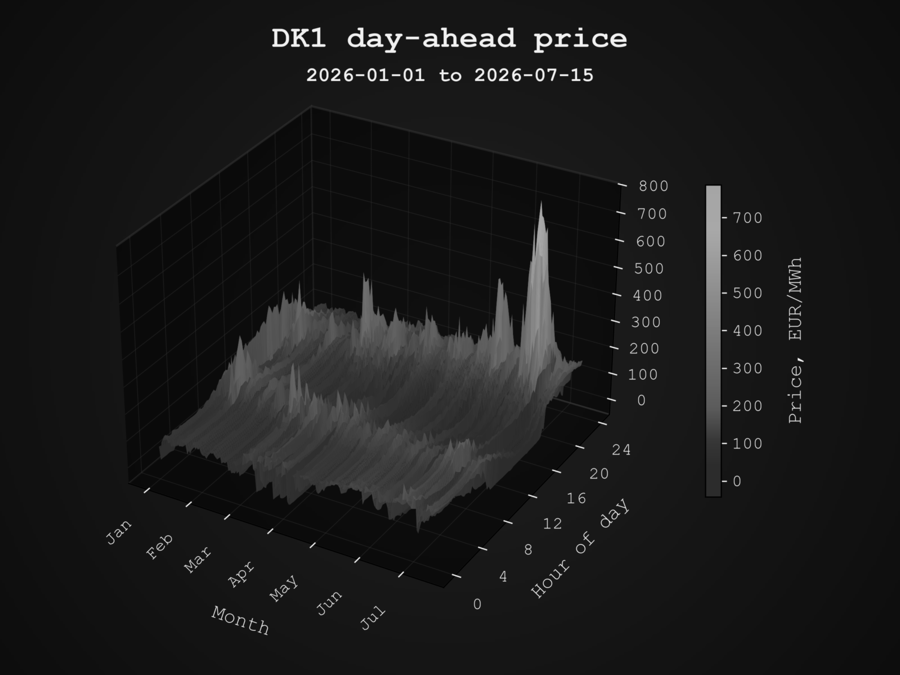
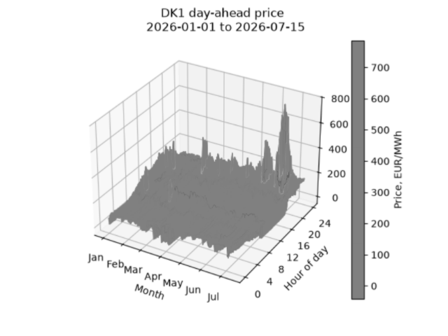
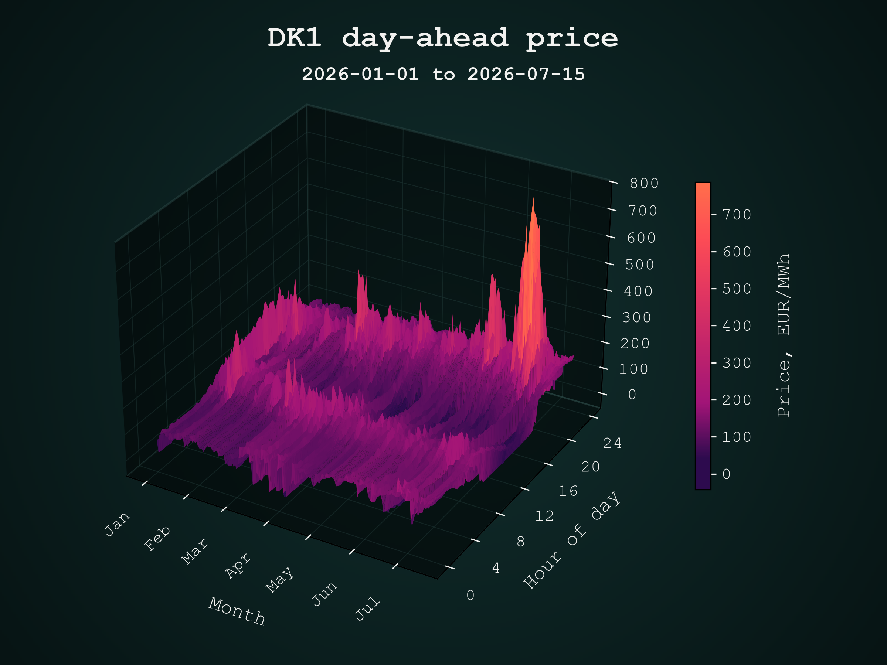
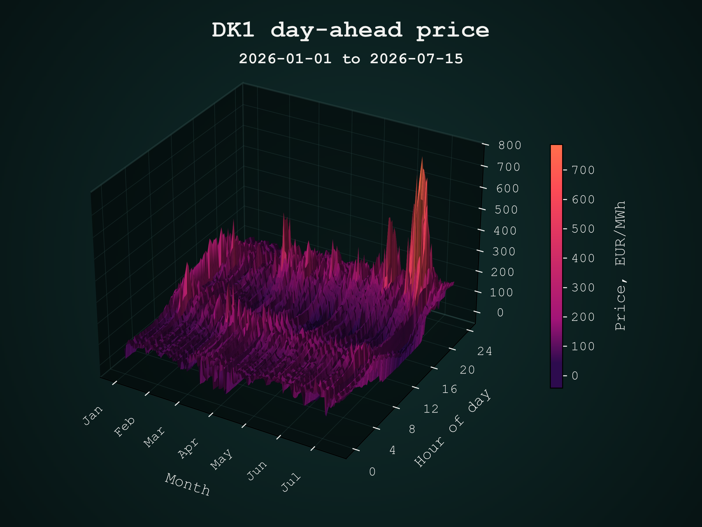

### Example 2:
3D price surface. Descriptions to be added.... 

Colour palette and plotting principles to be explained....

  

The resulting 3D figure to be explained....

  

Not a very beautiful figure with default plotting settings - to discuss....

  

Problems with the rainbow palette - to discuss....

  

### Grayscale comparison:

<table>
<tr>
<td align="center"> Beautiful (mean rule)</td>
<td align="center"> Rainbow (max rule)</td>
</tr>
</table>

### Do we need shades?

<table>
<tr>
<td align="center"> Without shades</td>
<td align="center"> With shades</td>
</tr>
</table>

### Facet colouring rule: mean vs max

<table>
<tr>
<td align="center"> Mean</td>
<td align="center"> Max</td>
</tr>
</table>

