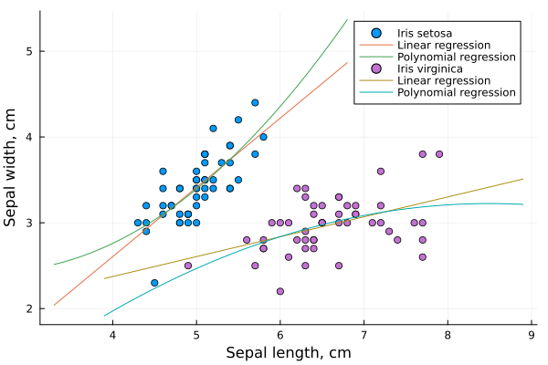
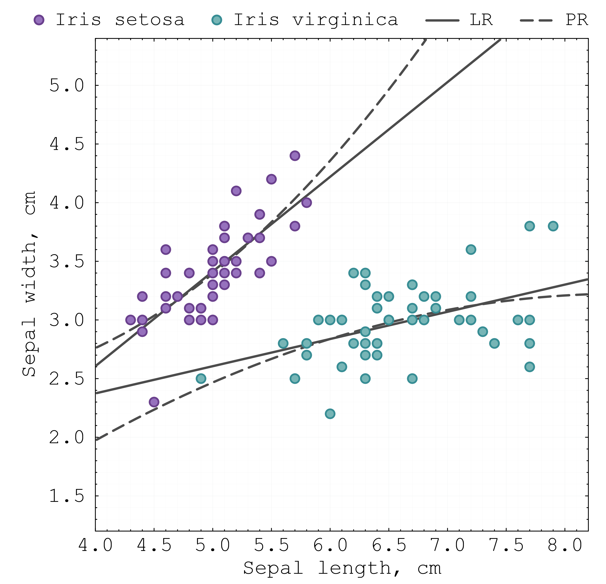
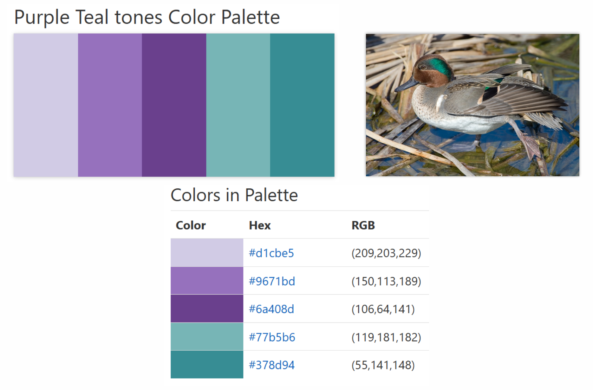
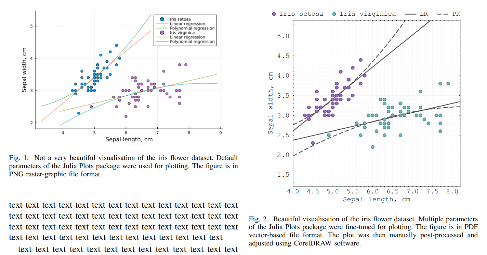

# Creating beautiful figures in Julia

To understand the beauty and effectiveness of visualisation, let's consider two figures created using the Plots.jl package in Julia: 1) one created with default plotting settings and 2) the other with carefully tuned plotting parameters and post-processing.

### Example 1:
Let's start with an easy approach where we drop our data into the plotting function using only the default plotting settings. That is, we do not customise fonts, colours or layout.
This simple default plotting is done in `not_a_very_beautiful_figure_example.jl`. The resulting figure looks as follows:

  

Even though we cannot claim that this figure is ugly or ineffective, it does have a number of flaws. Specifically, when used in a manuscript, this figure can lead to the following problems:

- The figure size may be arbitrary, and the aspect ratio may not suit the layout of a paper.
- The image resolution (in pixels) may be too low, causing problems when exporting or resizing.
- When saved as a PNG file, the figure will have pixels and lack the sharpness of vector graphics.
- The default font may not be ideal for a scientific publication.
- Also, the font might be small, which creates readability/visibility problems in the manuscript.
- The weights of lines may be inadequate. For example, some lines may be overly thin or thick.
- Similarly, the size of markers may be inconsistent.
- The default colours may not work well for our data. We may need to select another colour scheme.
- The legend may be misplaced, overlapping with data or taking excessive space outside the figure canvas.

### Example 2:
To avoid the above problems, we fine-tune the plotting parameters in `beautiful_figure_example.jl`. Specifically, the following adjustments are made when creating the figure in Plots.jl:

- We adjust the figure size and the X/Y axis ranges.
- We set the font style and size for readability.
- We modify the layout by adjusting plot margins, adding a frame, and setting an equal aspect ratio.
- We control grid lines and axis ticks.
- We select a harmonious, minimalistic colour scheme for all markers and lines.
- We adjust the line widths and the size of the markers.
- Using vector graphics software, we manually reposition the legend so that it displays compactly above the plotting area.

Finally, we export the figure in PDF and SVG formats (vector-based graphics), which will allow us to use it in a manuscript without loss of quality. The resulting figure looks as follows:

  

Note that during the design process, we selected the "Purple Teal tones" colour palette as the basis for our visualisation style. This palette, partially inspired by nature, allows us to create a minimalistic yet distinctive colour scheme for our data:

  

You can view the palette here: https://www.color-hex.com/color-palette/106106

When working on a single manuscript, all our figures should follow the style defined by this colour palette. That is, subsets of data should have the same colours throughout the manuscript to maintain consistency. Additional actions or indicators should also have consistent colours, e.g., red for bad data and green for new data. Any colours beyond this palette should be introduced carefully, not to disrupt the colour harmony and minimalism of the visual design.

### Comparison:
Now, let’s compare the two figures in a realistic setting: placed side by side in a two-column journal template.

  

The differences between the plotting parameters become clear now. We can see how the optimised layout helps us to better display data and makes the figure larger and more readable. 

This exercise highlights the importance of checking how your figures appear in real manuscript layouts. Remember that a figure might look fine in your coding environment, but that does not guarantee it is ready for publication. Always double-check key visual elements: font size, line weights, marker sizes, and overall layout. If the figure does not look good in the manuscript, adjust the parameters and iterate until you like the result.

### Other examples:
To be added...
