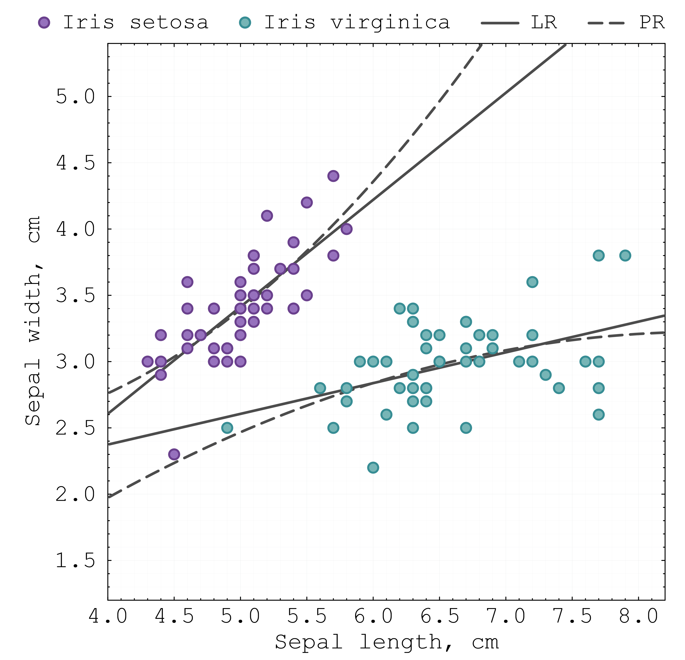

  

# BeautifulFigures
**Simple &amp; elegant figures for research papers, with examples in Julia and Python**

Creating high-quality figures for research papers is a difficult and time-consuming task. It usually requires extensive testing of various techniques to present the results of a study in the best possible way. Yet, there is limited training and guidance on developing high-quality illustrations. Many students and young researchers have to learn graphic design for scientific publications by trial and error. This sometimes affects the quality of publications: for example, pixelated images, small unreadable fonts and inadequate choice of colours can make papers unappealing to readers.

This repository shares the author's experience in creating beautiful vector-based figures tailored specifically for research papers. Several simple yet elegant figures are presented, with code examples in Julia and Python. For each figure, multiple plotting parameters are fine-tuned to ensure readability, colour harmony, minimalism, and consistency of the graphics.

For example, when visualising the Iris flower dataset using Julia’s Plots.jl package, we can produce this minimalistic yet effective figure:

  

In this example, multiple plotting parameters are fine-tuned to make the figure ideal for a two-column journal format. Specifically, the figure size and the X/Y axis ranges are modified to ensure readability. The font style and size are adjusted for academic publication. The grid lines, axis ticks, layout, margins, and size of markers are optimised to make the figure clear and easy to analyse. Finally, a harmonious minimalistic colour scheme is selected.

### PRINCIPLES OF BEAUTIFUL FIGURES:
There are a few design principles you can follow when creating beautiful figures for research papers:
- **The overall quality** → Use vector graphics (e.g., SVG, PDF) for pixel-free, scalable, publication-ready figures  
- **Readability** → Use clear fonts of proper sizes and optimise the layout of figures
- **Simplify and declutter** → Remove unnecessary elements, make your figure simple and effective
- **Colours** → use fewer colours, apply colours strategically and select harmonious color schemes
- **Message and story** → Think about the message or story of your figure. What do you want to tell the reader? 
- **Consistent style** → Maintain consistent fonts, colours and formatting across all figures  
- **To avoid** → Avoid pie charts and 3D plots (they often mislead the reader and make it difficult to analyse data)
- **Time** → Allocate enough time to make a good figure — iterate, refine, and polish
  
I elaborate more on these principles in the video tutorial: https://youtu.be/i-HAjex6VtM?si=p-n55VHc-3SOQAsG

### AUTHORS:
The repository is being developed by Dr. Andrey Churkin, Dyson School of Design Engineering, Imperial College London.
For more information, please visit my YouTube channel https://www.youtube.com/@chuscience and my website https://andreychurkin.ru/

### REFERENCES:
To be added...
